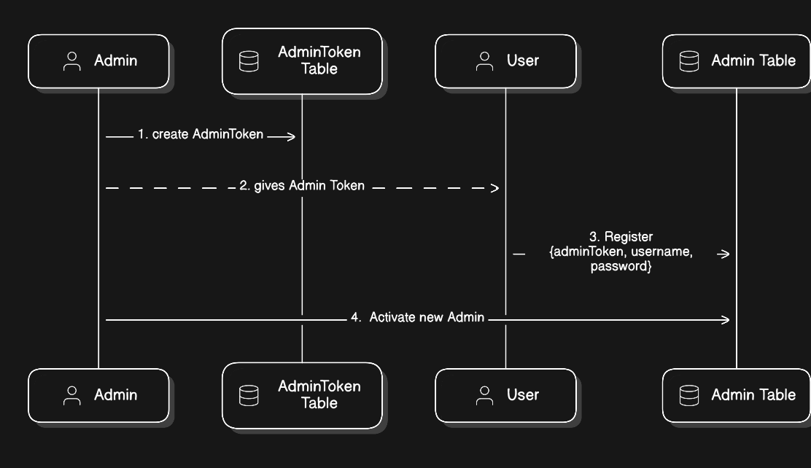
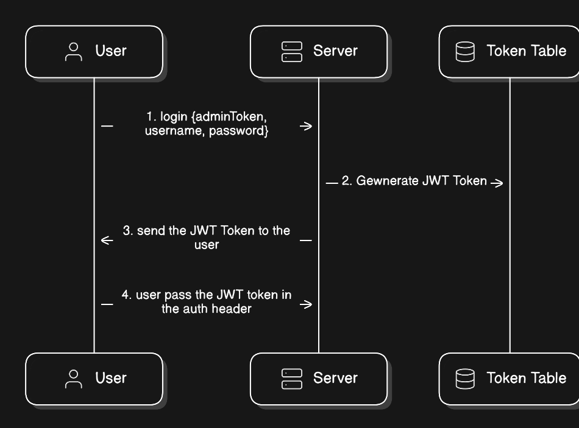

# Red Alert System Backend Clone

This repository contains a clone of the Israeli missile alert system backend. The system is designed to alert users about missile threats in real-time, using a public API to distribute alerts. Only registered admins have access to send alerts.

## Table of Contents

-   [Introduction](#introduction)
-   [Features](#features)
-   [Technologies Used](#technologies-used)
-   [Installation](#installation)
-   [Usage](#usage)
    -   [Register Admin](#register-admin)
    -   [Admin Login](#admin-login)
    -   [Sending Alerts](#sending-alerts)
    -   [Receiving Alerts](#receiving-alerts)
-   [App Structure](#app-structure)
-   [Diagrams](#diagrams)
    -   [App Structure Diagram](#app-structure-diagram)
    -   [New Alert Logic](#new-alert-logic)
    -   [Database Schema](#database-schema)
    -   [Register Admin Sequence Flow](#register-admin-sequence-flow)
    -   [Admin Login Sequence Flow](#admin-login-sequence-flow)
-   [License](#license)

## Introduction

This application is a backend clone of the Israeli missile alert system. It allows registered administrators to send missile alerts, which are then distributed via a public API. The system ensures that alerts are timely and accurately broadcasted to the public.

## Features

-   Admin registration and authentication
-   Secure admin login
-   Real-time alert distribution
-   Public API for receiving alerts

## Technologies Used

-   [Express.js](https://expressjs.com/) - Web framework for Node.js
-   [Prisma](https://www.prisma.io/) - ORM
-   [JWT](https://jwt.io/) - JSON Web Tokens for authentication
-   [Node.js](https://nodejs.org/) - JavaScript runtime

## Installation

1. Clone the repository:

    ```sh
    git clone https://github.com/YonatanEshed/red-alert-clone-backend.git
    cd red-alert-clone-backend
    ```

2. Install dependencies:

    ```sh
    npm install
    ```

3. Set up environment variables:

    - Create a `.env` file in the root directory.
    - Add the following environment variables:
        ```env
        DATABASE_URL=your_database_url
        JWT_SECRET=your_jwt_secret
        ```

4. Start the server:
    ```sh
    npm start
    ```

## Usage

### Register Admin

1. Registered admin sends a `GET` request to `/adminToken` and receives:

    ```json
    {
        "token": "AdminToken"
    }
    ```

2. New admin Send a `POST` request to `/register` with the following body:
    ```json
    {
        "username": "admin",
        "password": "password",
        "adminToken": "adminToken"
    }
    ```
3. Registered admin sends a `PUT` request to `/activateAdmin/:id` to activate the new admin.

### Admin Login

1. Send a `POST` request to `/login` with the following body:

    ```json
    {
        "username": "admin",
        "password": "password"
    }
    ```

2. You will receive a token that should be used for authenticated requests.

### Sending Alerts

1. Send a `POST` request to `/alerts` with the following body:
    ```json
    {
        "type": "AlertTypeId",
        "cities": ["cityId", ...]
    }
    ```
    - Ensure you include the token in the `Authorization` header.

### Receiving Alerts

1. Send a `GET` request to `/liveAlert` to receive the latest alerts.

### Alerts History

1. Send a `GET` request to `/alerts` to receive all alerts.

## Diagrams

### App Structure Diagram


### New Alert Logic


### Database Schema


### Register Admin Sequence Flow



### Admin Login Sequence Flow


